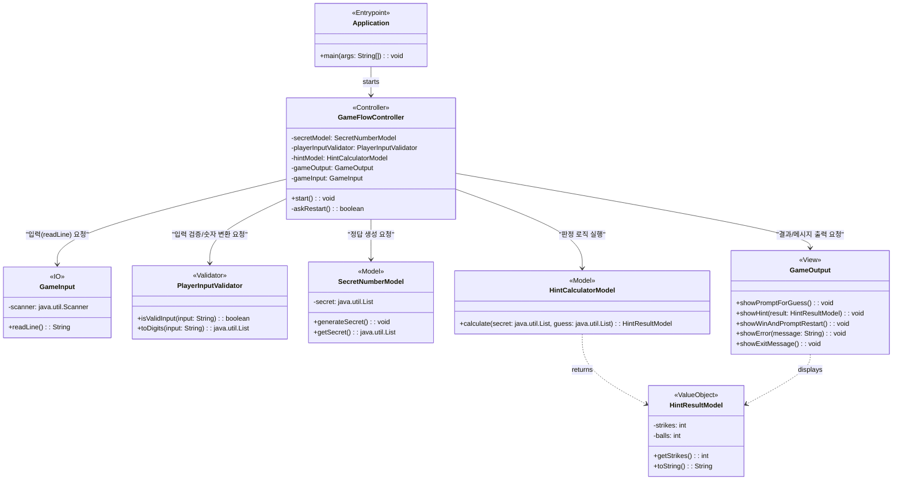

# 숫자 야구 게임 기능 구현 목록

## 게임 초기화 (컴퓨터)

* 1에서 9까지의 서로 다른 임의의 수 3개를 생성한다.

## 사용자 입력

* 플레이어로부터 서로 다른 3자리의 수를 입력받는다.
* 게임 종료 후 재시작(1) 또는 종료(2) 여부를 입력받는다.

## 입력 유효성 검사

* 사용자가 잘못된 값을 입력할 경우 [ERROR]로 시작하는 에러 메시지를 출력한다.
* 에러 메시지 출력 후 게임을 종료하지 않고 다시 입력을 받는다.

## 게임 결과 판정 (볼/스트라이크 계산)

* 컴퓨터의 수와 플레이어의 수를 비교하여 결과를 계산한다.
* 같은 수가 같은 자리에 있으면 스트라이크.
* 같은 수가 다른 자리에 있으면 볼.
* 같은 수가 전혀 없으면 낫싱.

## 결과 출력

* 계산된 볼, 스트라이크 개수를 출력한다 (예: 1볼 1스트라이크, 낫싱).
* 3개의 숫자를 모두 맞히면(3스트라이크) 게임 종료 문구를 출력한다.

